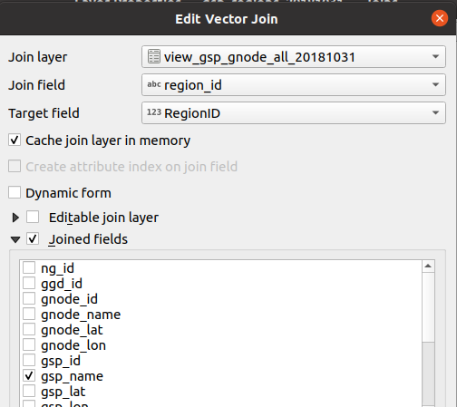

# Geographies

## NUTS 1 regions
### About
This is the first level Nomenclature of Territorial Units for Statistics (NUTS) for Great Britain. It comprises 11 regions; 9 covering Enlgland plus Scotland and Wales. More information is available on [wikipedia](https://en.wikipedia.org/wiki/NUTS_statistical_regions_of_the_United_Kingdom).

Image [CC-BY-SA 3.0 Piccolo Modificatore Laborioso](https://en.wikipedia.org/wiki/File:United_Kingdom_NUTS_1.png).

### Processign steps

1. [Download](https://geoportal.statistics.gov.uk/datasets/nuts-level-1-january-2018-ultra-generalised-clipped-boundaries-in-the-united-kingdom?geometry=-83.119%2C46.025%2C78.248%2C63.439) the Ultra Generalised Clipped Boundaries from the ONS Open Georgarphy Portal.
2. Remove Northern Ireland from the downloaded file (as National Grid only covers Great Britain). There are several ways to do this. A graphical user interface option is to use [QGIS](https://www.qgis.org/en/site/). 
..1. Open the file in QGIS (Layer -> Add Layer -> Add Vector Layer...)
..2. Select all features except Northern Ireland.
..3. Use Layer -> Save As.. to save the layer. Use GeoJSON as the format, tick 'Save only selected feaures' and keep just the 'nuts118cd' and 'nuts118nm' fields. Call the file 'nuts1_BUC_27700.geojson'.
3. Re-project the data from the British grid reference system (EPSG:22770) to latitude and longitude (EPSG:4326). Again there are many ways to do this but QGIS can also be used here.
..1. In QGIS use Layer -> Save As.. to save the layer as before. This time set the CRS to 'EPSG:4326 - WGS 84'. Save the layer as 'nuts1_BUC_4326.geojson'. 
..2. You can also make the filesize smaller (better for web) by setting the 'Coordinate precision' (under Layer Options in the save dialogue) to 4. In the UK a precision of 4 [relates to](https://en.wikipedia.org/wiki/Decimal_degrees) an accuracy of about 6 metres.

Note: The re-projection that QGIS uses is only accurate to about 2 meters. It is possible to do a prefect re-projection but given that we are only saving to 4 decimal degrees, this level of accuracy is sufficient.

### Files
If you follow the steps above you should have the following files:

| Filename                                        | Description                                                                                        |
| ----------------------------------------------- | -------------------------------------------------------------------------------------------------- |
| NUTS*Level_1*(January_2018)\_Boundaries-shp.zip | The original download.                                                                             |
| nuts1_BUC_27700.geojson                         | As above but removing Northern Ireland and saving as a geoJSON.                                    |
| nuts1_BUC_4326.geojson                          | As above but re-projecting to latitude and longitude and saving with a 4 decimal degrees accuracy. |

## GSPs 2018
### Warning!
Whilst the steps below work and can be used to get a visualisation up and running, this is not the version we use on the site. As such it has not been thoroughly checked and may include probelms (e.g. missing GSPs).

### About
This is the Grid Supply Point (GSP) regions as developed by Sheffield Solar in 2018. As the regions were being used by multiple teams in National Grid ESO, each with slightly differing needs, the source file include areas that represent GNODES and Elexon registered GSPs. Some processing is required to join a few areas together to form the GSP. 

A GSP is the point of connection (substation) between a transmission network and a distribution network. As such it does not include transmission direct connects such as large induistrial users and large network rail connections as there is no distribution network involved. The cable that brings power in from offshore wind farms is owned by an Offshore Transmission Owner (OFTO). Some early offshore wind farms connect in to a distribution network. This therefore creates a transmission to distribution connection and therefore an Elexon registered GSP.

If a substaion supplies two or more distribution licence ares (GSP Groups) then there will be two or more GSPs registered at the same substation. Each registered GSP is therefore associated with just one distribution licence area.

### Processing steps

1. [Download](https://data.nationalgrideso.com/system/gis-boundaries-for-gb-grid-supply-points) the regions shapefile or geoJSON (it doesn't matter) and the region lookup CSV file from the ESO Data Portal.
2. As noted in About above, some processing is required to join a few areas together to form the GSPs. To do this we can use QGIS.
..1. Open QGIS and add the regions file using Layer -> Add Layer -> Add Vector Layer...
..2. You also need to add the attribute CSV file (Add layer → Delimited, select no geometries options)
..3. Right click the vector layer in the layers list and click Properties. Under Join, click + and set up a Join as shown in the image below to add the gsp_name from the attribute table to the geometries by matching on region_id (the common field present on both the attribute table and the geometries). Set the 'Customer field name prefix' to blank.
..4. Now that the GSP name has been added to the geometries, we can merge any geometries that have the same GSP name as others. To do this use Vector → Geoprocessing tools → Dissolve. Under 'Dissolve filed(s)' tick gsp_name.
..5. Finally Layer → Save As the resultant 'Dissolved' layer as a geojson and on British grid reference system (EPSG:22770). Save the file as 'gsps2018_27700.geojson'.
3. Re-project the data from the British grid reference system (EPSG:22770) to latitude and longitude (EPSG:4326). Again there are many ways to do this but QGIS can also be used here.
..1. In QGIS use Layer -> Save As.. to save the layer as before. This time set the CRS to 'EPSG:4326 - WGS 84'. Save the layer as 'gsps2018_4326.geojson'.
4. Finally we prepare the file ready for use in the visualisation portal. Again using QGIS.
..1. Right clcik the 'gsps2019_4326' layer in the QGIS layer list and click Properties...
..2. Click 'Fields', click the pencil button, and double click on 'gsp_name' to replace it with the text "Primary".
..3. Use Layer -> Save As.. to save the layer as before. This time keep just the Primary filed and make the filesize smaller (better for web) by setting the 'Coordinate precision' (under Layer Options in the save dialogue) to 4. In the UK a precision of 4 [relates to](https://en.wikipedia.org/wiki/Decimal_degrees) an accuracy of about 6 metres. Save as gridsupplypoints-unique-all.geojson.

Image to help with step 3 above.

### Files
If you follow the steps above you should have the following files:

| Filename                                  | Description                                                                                                |
| ----------------------------------------- | ---------------------------------------------------------------------------------------------------------- |
| gsp_regions_20181031.zip OR .geojson      | The original download of the areas.                                                                        |
| gsp_gnode_directconnect_region_lookup.csv | The lookup table.                                                                                          |
| gsps2018_27700.geojson                    | GSP attributes added and sub-areas 'dissolved' together.                                                   |
| gsps2018_4326.geojson                     | As above but re-projecting to latitude and longitude.                                                      |
| gridsupplypoints-unique-all.geojson       | As above but removing all fields except gsp_name, which is remaned to Primary. Saving with precision of 4. |

## GSPs 2019
### About
This is the Grid Supply Point (GSP) regions as refined by Sheffield Solar in 2019. As the regions were being used by multiple teams in National Grid ESO, each with slightly differing needs, the source file include areas that represent GNODES and Elexon registered GSPs. Some processing is required to join a few areas together to form the GSP. 

A GSP is the point of connection (substation) between a transmission network and a distribution network. As such it does not include transmission direct connects such as large induistrial users and large network rail connections as there is no distribution network involved. The cable that brings power in from offshore wind farms is owned by an Offshore Transmission Owner (OFTO). Some early offshore wind farms connect in to a distribution network. This therefore creates a transmission to distribution connection and therefore an Elexon registered GSP.

If a substaion supplies two or more distribution licence ares (GSP Groups) then there will be two or more GSPs registered at the same substation. Each registered GSP is therefore associated with just one distribution licence area.

### Steps / files

The steps here are not as friendly as those above as the file is more complicated and requires additional processing. Below is a record of the steps taken in QGIS.

#### Regions_Final_20190701 TO SHARE.zip 

Original file as created by Owen at Sheffield Solar. We use the 20190812 shapefilee.

#### Regions_20190812_fixed.zip

As above but with the one invalid geometry manually fixed. 

#### Regions_20190812_fixed_and_new_region_P.zip

As above but with the north scotland data replaced by SSE_P_2021.zip data. 

#### Cleaned100.geojson 

Simplified geometry. If simplifying/generalising any shapes use GRASS v.generalize as this does not create slivers between polygons. For some unknown region this works of \_F but doesn't work on the combined GB dataset -- it complains about not being able to find area centroids. To fix: 

  * Open Regions\_fixed\_and\_new\_region_P.zip
  * Run Vector→Geometry Tools → Multipart to Singlepart... 
  * Save as geojson (selecting Polygon as the gemoetry type) 
  * Clean the geojson using v.clean (Select All cleaning tools, set v.in.org min area to 100, the v.out.org output type to area, on the "input feature types" keep just area, set v.in.org snap tolerance to 5\. 
  * Use v.generalise with maximal tolerance value of 100\. 
  * Save as geojson (area), keeping just the new\_id and GSP entries in the attribute table and setting the precision to 5 (decimal places). 

#### Cleaned100\_attributes.geojson 

As above but with attributes joined from Region\_attributes.csv. Join “Region ID” to “New ID”. Adjusted the Scotland North data to fit the new field names ("GSP"->"GSP(s)" and set "GSP Group"="_P").

#### Cleaned100\_a\_dGSP.geojson & Cleaned100\_a\_dDNO.geojson 
As above but dissolved to GSP (using the GDAL dissolve tool as others complained about invalid geometry). Note that BRLE\_2 and BRLE_3 have been merged in with "FLEE\_1;BRLE\_1" as these are not seperate GSPs in Elexon's registered list.

And, as Cleaned100\_attributes.geojson but dissolved to DNO licence area (using the GDAL dissolve tool as others complained about invalid geometry). 

#### GSP.geojson & DNO.geojson 
As above but transformed to lat/long (QGIS so accurate to 2m) and save to 4 decimal places (so accurate to circa 8m). 

#### GSP_post.geojson
As above but with some post processing done via Post\_process\_GSPs2019.ipynb so as to adjust for GSPs we don't have mapped (e.g. embeeded offshore wind OFTOs).

### Notes
If simplifying/generalising any shapes use GRASS v.generalize as this does not create slivers between polygons. For some unknown region this works of distribution licence are \_F but doesn't work on the combined GB dataset -- it complains about not being able to find area centroids. To fix: 

* Open Region\_20190812 
* Run Vector→Geometry Tools → Multipart to Singlepart... 
* Save as geojson (selecting Polygon as the gemoetry type) 
* Clean the geojson using v.clean (Select All cleaning tools, set v.in.org min area to 100, the v.out.org output type to area, on the "input feature types" keep just area, set v.in.org snap tolerance to 5\. 
* Use v.generalise with threshold 100 
* * Save as geojson (area), keeping just the new\_id on the attribute table and setting the precision to 5 (decimal places).

## Further geometry options
There are additional geometries that we have not used, but might be of interest.

From the ONS:
* [Countries](https://geoportal.statistics.gov.uk/datasets/countries-december-2019-gb-buc)
* [Local Authority Districts](https://geoportal.statistics.gov.uk/datasets/local-authority-districts-may-2020-boundaries-uk-buc) 
* [Counties and UAs](https://geoportal.statistics.gov.uk/datasets/local-authority-districts-may-2020-boundaries-uk-buc) 

New GSP regions are also worthwhile exploring. Since we last updated them (2019) more Distribution Networks have now produced their own regions.
